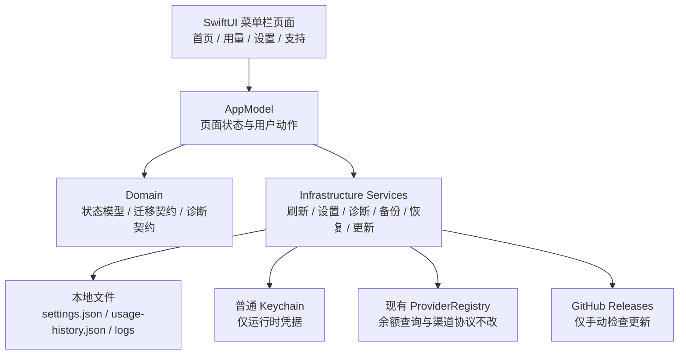
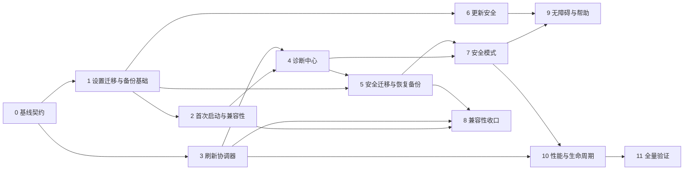

# 智余 Mac 通用能力建设实施计划

> **For agentic workers:** REQUIRED SUB-SKILL: Use superpowers:subagent-driven-development (recommended) or superpowers:executing-plans to implement this plan task-by-task. Steps use checkbox (`- [ ]`) syntax for tracking.

**Goal:** 在智余现有余额查询、渠道管理、报警、用量统计和菜单栏交互之上，补齐一套本地优先、可诊断、可迁移、可恢复、可维护的 macOS 通用能力，使首次使用、刷新失败、设置迁移、更新失败和异常启动都有明确可见的处理路径，同时不改变现有渠道协议、密钥存储边界和用量统计口径。

**Architecture:** 延续 `Domain → Infrastructure → App` 三层结构。保留 `AppModel` 作为界面状态中心，但把首次启动、刷新编排、诊断、迁移、备份、恢复和更新安全校验拆为小型可测试服务；通过显式模型和协议连接 SwiftUI 页面，避免把通用能力继续堆进 `AppModel.swift` 或复制智额的实现。

**Tech Stack:** macOS 15.0+, Swift 6.0, SwiftUI + AppKit, Tuist, XCTest, Swift Charts（已有依赖）。P1 不增加第三方依赖、不引入云端服务、不引入新的账号认证方式。

## Global Constraints

1. **目录边界。** 本计划只适用于 `/Users/yancyfeng/Desktop/Mac Dpxx项目/自研软件/智余`。参考项目 `/Users/yancyfeng/Desktop/Mac Dpxx项目/自研软件/智额` 只读，不修改、不复制其项目文件、不在其仓库提交任何内容。

2. **实施边界。** 当前交付物是计划文件，不代表已经实现、编译、安装、发版或上传 GitHub。执行本计划前，必须重新检查工作区状态，并按任务逐项完成测试和人工验收。

3. **本地优先。** P1 所有数据留在本机：设置、用量历史、诊断报告、迁移备份和崩溃恢复标记均使用本地文件。P1 不新增遥测、云同步、崩溃上传、远程诊断、账号注册或后台服务。

4. **密钥边界。** API Key、Session Cookie、SMTP 密码和其他凭据继续只进入智余现有普通 Keychain 命名空间 `com.smartbalance.zhiyu.plain`。不调用 Touch ID、生物识别、`SecAccessControl` 或登录钥匙串授权弹窗；不在诊断包、设置迁移包、日志和备份中导出密钥值。

5. **现有 Keychain 兼容。** 不自动读取、删除或迁移旧版受保护 Keychain 条目。设置迁移只携带非敏感账号元数据；导入后为账号生成新的凭据引用，并明确显示“需要重新填写凭据”。

6. **用量统计不回归。** 保留当前 `UsageHistoryStore`、`UsageAccumulator`、`UsageSummaryBuilder` 的口径：自然日、ISO 周、自然月；CNY、USD 和未知单位分开统计；保留当前历史保留期和失败快照处理语义。通用能力只提供刷新、保存失败提示、诊断和备份适配，不重新设计用量算法。

7. **渠道不回归。** 不修改 Provider DTO、请求签名、渠道认证、余额字段映射和真实请求策略。任何需要渠道真实网络的测试必须单独获得授权；默认使用现有 `HTTPClientMock`、fixture 和手录渠道测试。

8. **界面约束。** 保留智余已有菜单栏应用、固定约 `380×580` 菜单内容、可固定窗口、首页/用量/设置三段导航、右上角齿轮和底部用量入口。新增页面必须适配菜单栏窄窗口，不把智额的布局或品牌文案直接复制过来。

9. **更新策略。** P1 只做“检查更新 → 查看版本说明 → 用户明确确认 → 下载 → 校验 → 安装”的手动流程。自动下载、自动安装、Beta 通道和匿名崩溃上传全部属于 P2，且默认关闭。

10. **失败安全。** 设置、用量历史和迁移写入必须原子替换；迁移或恢复失败时保留原文件并写入可定位的错误记录；任何“重置”动作先创建本地备份，且不删除 Keychain 凭据。

11. **隐私最小化。** 诊断报告只导出版本、系统、架构、目录可写性、状态摘要、错误分类和已脱敏日志片段，不导出完整请求 URL 中的查询参数、请求头、响应体、Cookie、Keychain 内容、邮箱地址和原始日志。

12. **兼容旧数据。** 现有根目录 `settings.json`、`usage-history.json`、旧字段（例如 `emailAlertModeEnabled`）和未知 JSON 字段必须有明确的读取策略。升级不能因新增 schema 直接把账号列表、报警配置、用量基线或历史清空。

13. **并发与取消。** 使用 Swift 6 严格并发。刷新必须支持取消、去重、旧任务结果丢弃和 sleep/wake 后恢复；不能让一个过期网络响应覆盖新结果，也不能让失败的用量写入阻塞余额结果展示。

14. **本地改动保护。** 执行任务前保留用户现有的 dirty/untracked 文件，不运行 `git reset --hard`、`git checkout --`、批量删除或覆盖不属于本任务的文件。每个任务完成后只提交该任务实际产生的纯改动。

15. **证据分层。** 报告时分别说明：源代码完成、单元/集成测试通过、Debug/Release 构建通过、安装包生成、运行时人工验收、GitHub Release、用户验收。测试通过不等于已发布，模拟网络通过不等于真实渠道通过。

---

## 1. 参考方案与智余适配结论

### 1.1 参考文件

本计划参考：

`/Users/yancyfeng/Desktop/Mac Dpxx项目/自研软件/智额/docs/superpowers/plans/2026-08-14-mac-common-capabilities.md`

参考方案提供了通用能力的完整分类：首次启动、刷新编排、诊断中心、安全迁移、备份恢复、兼容性、更新安全、崩溃恢复、无障碍、帮助、性能和分阶段发布。

### 1.2 直接采用的原则

| 智额方案原则 | 智余落地方式 |
|---|---|
| Domain / Infrastructure / App 分层 | 继续使用智余现有三层和 Tuist target，不增加平行架构 |
| 首次启动先检查环境 | 在菜单栏页面首次出现前检查 macOS、架构、目录、Keychain 和通知状态 |
| 刷新由统一协调器管理 | 从 `AppModel` 当前 `activeRefreshTask`、generation 和单账号刷新逻辑中抽出最小协调层 |
| 诊断报告可读、可导出、默认脱敏 | 新增本地诊断服务和诊断中心，禁止原始密钥、请求体和完整日志外泄 |
| 迁移、恢复和更新失败可回退 | 所有写入使用临时文件 + 原子替换，恢复前创建快照，更新前校验资源 |
| P1 本地能力，P2 远程能力 | P1 不做遥测/自动更新/崩溃上传，P2 只有在隐私和后端条件满足时才开启 |
| 每个任务有红灯、绿灯和验收门 | 任务按 TDD 顺序执行，先失败测试，再最小实现，再全量验证 |

### 1.3 不直接复制的内容

| 不复制项 | 原因和智余决定 |
|---|---|
| 智额的 `SmartQuotaApp`、配额模型、Provider 名称和文件名 | 智余已有 `SmartBalanceApp`、余额快照、渠道注册表和用量统计，复制会造成两个产品模型并存 |
| 智额的生物识别/受保护密钥逻辑 | 智余已经明确改为普通 Keychain；本计划保持“只要普通 Keychain，不弹 Touch ID/密码” |
| Windows、跨平台目录、跨端 Native Messaging | 智余当前是 macOS 菜单栏应用，超出范围 |
| 自动上传崩溃和匿名诊断 | 没有已确认的后端、隐私声明和用户同意流程，列为 P2 阻断项 |
| 重新实现用量统计 | 智余用量统计已经存在，通用能力只围绕保存、刷新和可诊断性增强 |
| 新增第三方 UI/网络依赖 | 当前 SwiftUI、AppKit、Swift Charts 和现有 HTTP 客户端足够完成 P1 |

---

## 2. 当前智余基线与问题清单

以下基线来自本次只读检查，执行计划时仍要用命令重新确认。

### 2.1 已存在且必须复用的能力

- 产品入口：`Apps/Mac/Sources/App/SmartBalanceApp.swift`、`AppDelegate.swift`、`MenuRootView.swift`。
- 状态中心：`Apps/Mac/Sources/App/AppModel.swift`，当前承载设置、余额快照、刷新任务、用量历史、通知、更新状态和页面选择。
- 设置：`Apps/Mac/Sources/Infrastructure/SettingsStore.swift`，路径为 `~/Library/Application Support/SmartBalance/settings.json`，已有原子写入、`0600` 权限、损坏文件备份和空账号覆盖保护。
- 密钥：`Apps/Mac/Sources/Infrastructure/LocalSecretStore.swift`，使用普通 Keychain service `com.smartbalance.zhiyu.plain`。
- 备份：`Apps/Mac/Sources/Infrastructure/DataBackupService.swift`，当前 `DataBackupPackage` v1 **包含明文 `secrets`**，这是通用能力实施前必须收敛的安全边界。
- 用量：`UsageModels.swift`、`UsageAccumulator.swift`、`UsageSummaryBuilder.swift`、`UsageHistoryStore.swift` 和 `Views/Usage/*` 已形成完整的本地日/周/月统计链路。
- 更新：`UpdateChecker.swift`、`ReleaseDownloader.swift`、`PackageSilentInstaller.swift` 已有 GitHub Releases 检查、下载和安装基础，但仍需要版本说明、资源校验和失败恢复层。
- 日志和通知：`AppLog.swift`、`MacNotificationService.swift` 已存在，但日志尚未形成诊断导出所需的统一脱敏、轮转和权限策略，通知授权发生时机也需要纳入首次启动设计。

### 2.2 当前缺口

1. 没有明确的首次启动状态和兼容性报告，用户无法知道“为什么没有数据”是未配置、Keychain 不可用、目录不可写还是渠道失败。
2. 刷新编排主要集中在 `AppModel.swift`，需要把取消、并发、sleep/wake 和旧结果丢弃规则固定成可测试契约。
3. 没有统一诊断中心，也没有安全的日志/状态导出包。
4. 现有备份 v1 将 Keychain 密钥值放进 JSON，不能继续作为默认导出路径。
5. `AppSettings` 当前通过自定义 `Codable` 兼容部分旧字段，但没有独立 schema、迁移记录和未知字段保留策略。
6. `UsageHistoryStore` 已有损坏恢复基础，但没有纳入通用诊断、备份恢复和“余额保存成功而用量保存失败”的用户提示闭环。
7. 更新下载和安装没有统一的最低系统版本、资源大小、SHA-256、签名/包完整性和失败回滚报告。
8. 现有 `AppModel` 和部分设置页面仍有硬编码中文文案；新增通用能力若继续硬编码，会破坏已有多语言和窄窗口体验。
9. `PROJECT_STATUS.md` 顶部记录的版本与 `Apps/Mac/Sources/App/Info.plist` 当前 `0.3.1 / build 82` 不一致，需要在任务 0 做文档基线纠正。

### 2.3 数据与隐私路径

| 数据 | 当前/目标位置 | 通用能力规则 |
|---|---|---|
| 设置 | `~/Library/Application Support/SmartBalance/settings.json` | schema 迁移、原子写入、`0600`、不保存密钥值 |
| 用量历史 | `~/Library/Application Support/SmartBalance/usage-history.json` | 保留现有 400 天和统计语义，可选纳入本机恢复备份 |
| Keychain 凭据 | `com.smartbalance.zhiyu.plain` | 不导出、不上传、不做生物识别授权；导入后重新配置 |
| 日志 | `~/Library/Logs/SmartBalance/app.log` | 本地轮转、限制大小、诊断导出前脱敏 |
| 崩溃/异常标记 | Application Support 下新的 `recovery-state.json` | 只记启动状态和失败分类，不记密钥或原始响应 |
| 诊断包 | 用户选择的位置 | 只含 allowlist 字段和已脱敏文本，生成后 `0600` |

---

## 3. 目标架构与公共契约

### 3.1 分层和依赖



### 3.2 状态中心边界

`AppModel` 继续是 `@MainActor` 的界面状态中心，但完成后只负责：

- 发布设置、余额快照、用量摘要、页面状态和用户可见错误。
- 调用 `RefreshCoordinator`、`DiagnosticsService`、`SettingsTransferService`、`BackupManager` 和 `UpdateSafetyValidator`。
- 把服务结果转换成 `@Published` 状态和可定位的 banner/alert。
- 维持现有 Provider、通知、SMTP、用量摘要 API 的兼容入口。

以下逻辑不得继续直接扩展到 `AppModel.swift`：文件格式迁移、日志脱敏、备份包编码、恢复回滚、发布资源校验和 sleep/wake 任务去重。

### 3.3 目标公共模型

实现时按任务逐步创建以下模型；名称可在代码审查时微调，但语义必须保持一致。

```swift
public struct FirstLaunchState: Codable, Sendable, Equatable {
    public var schemaVersion: Int
    public var completedAt: Date?
    public var acknowledgedPrivacy: Bool
    public var lastCompatibilityReport: CompatibilityReport?
}

public enum RefreshScope: Sendable, Equatable {
    case all
    case account(UUID)
    case visible
}

public enum RefreshState: Sendable, Equatable {
    case idle
    case running(scope: RefreshScope, startedAt: Date)
    case cancelling
    case succeeded(completedAt: Date, refreshedCount: Int)
    case partiallyFailed(completedAt: Date, succeeded: Int, failed: Int)
    case failed(completedAt: Date, messageKey: String)
}

public struct PortableSettings: Codable, Sendable, Equatable {
    public var format: String
    public var formatVersion: Int
    public var exportedAt: Date
    public var appVersion: String
    public var accounts: [PortableAccount]
    public var email: PortableEmailSettings
    public var alertChannels: AlertChannelSettings
    public var apiQueryEnabled: Bool
    public var refreshIntervalSecs: Int
    public var windowPinned: Bool
    public var themeMode: String
    public var appLanguage: String
}

public struct DiagnosticCheck: Identifiable, Codable, Sendable, Equatable {
    public var id: String
    public var titleKey: String
    public var status: DiagnosticStatus
    public var detailKey: String
    public var redactedDetail: String?
}

public struct DiagnosticReport: Codable, Sendable, Equatable {
    public var generatedAt: Date
    public var appVersion: String
    public var osVersion: String
    public var architecture: String
    public var checks: [DiagnosticCheck]
    public var sanitizedLogLines: [String]
    public var excludedFields: [String]
}
```

`PortableAccount` 不包含 `secretRef`、API Key、Cookie 或 SMTP 密码；导入时由应用生成新的引用。`DiagnosticReport` 不接受 Provider 原始响应作为字段，任何响应摘要必须先经过 allowlist 和 redactor。

### 3.4 实施期间的目录映射

| 层 | 新增文件 | 既有文件的最小修改 |
|---|---|---|
| Domain | `Sources/Domain/Support/FirstLaunchModels.swift`、`RefreshModels.swift`、`DiagnosticModels.swift`、`PortableTransferModels.swift`、`CompatibilityModels.swift`、`RecoveryModels.swift`、`UpdateModels.swift` | `AppSettings.swift`、必要时 `BalanceAccount.swift` 增加迁移/便携转换，不改变 Provider 业务字段 |
| Infrastructure | `Sources/Infrastructure/Support/FirstLaunchStore.swift`、`SettingsMigrationRunner.swift`、`CompatibilityChecker.swift`、`RefreshCoordinator.swift`、`DiagnosticsService.swift`、`PrivacyRedactor.swift`、`SettingsTransferService.swift`、`BackupManager.swift`、`CrashRecoveryStore.swift`、`UpdateSafetyValidator.swift` | `SettingsStore.swift`、`DataBackupService.swift`、`UsageHistoryStore.swift`、`AppLog.swift`、`UpdateChecker.swift`、`ReleaseDownloader.swift`、`PackageSilentInstaller.swift`、必要时 `MacNotificationService.swift` |
| App | `Sources/App/Views/Onboarding/FirstLaunchView.swift`、`CompatibilityView.swift`、`Views/Support/DiagnosticsCenterView.swift`、`SettingsTransferView.swift`、`BackupRestoreView.swift`、`UpdateDetailsView.swift`、`HelpCenterView.swift`、`Views/Recovery/SafeModeView.swift` | `SmartBalanceApp.swift`、`AppDelegate.swift`、`AppModel.swift`、`MenuRootView.swift`、`SettingsRootView.swift`、`Localization/L10n.swift`、`Theme/AppMotion.swift` |
| Tests | `Tests/DomainTests/*CommonCapabilitiesTests.swift`、`Tests/InfrastructureTests/*CommonCapabilitiesTests.swift`、必要时 `Tests/AppTests/*Tests.swift` | 复用 `HTTPClientMock.swift`、现有 `UpdateCheckerTests.swift`、`UsageHistoryStoreTests.swift`、`LocalSecretStoreTests.swift`，不把真实 Provider 当作通用能力测试依赖 |

---

## 4. 交付分层、依赖关系和优先级

### 4.1 P1 必做范围

| 批次 | 任务 | 依赖 | 结果 |
|---|---|---|---|
| P1-A 基础 | 0. 基线与契约 | 无 | 可复现基线、数据清单、隐私 allowlist |
| P1-A 基础 | 1. 设置 schema、迁移和安全备份基础 | 0 | 旧设置可读、新写入可回滚、默认导出不含密钥 |
| P1-A 基础 | 2. 首次启动与兼容性 | 1 | 新用户知道下一步，旧环境能解释问题 |
| P1-A 基础 | 3. 刷新协调器 | 0 | 刷新取消、去重、旧响应丢弃规则可测试 |
| P1-B 支持 | 4. 诊断中心 | 1、2、3 | 用户能得到可读、可导出的本地诊断 |
| P1-B 支持 | 5. 设置迁移与本机备份恢复 | 1、4 | 安全迁移、不携带密钥、恢复失败不破坏原数据 |
| P1-B 支持 | 6. 更新详情与安全安装 | 0、1 | 手动更新有版本说明、资源校验和失败提示 |
| P1-C 韧性 | 7. 崩溃恢复与安全模式 | 1、4、5 | 异常启动可进入不刷新安全模式 |
| P1-C 韧性 | 8. 兼容性、用量和通知迁移收口 | 1、2、3、5 | 旧数据、用量历史、通知权限与通用流程一致 |
| P1-C 体验 | 9. 无障碍、帮助和错误 UX | 2、4、6、7 | 窄窗口、多语言、VoiceOver、错误行动路径可用 |
| P1-C 质量 | 10. 性能、功耗和生命周期 | 3、7、9 | 长时间运行不重复刷新、不无限写日志 |
| P1-C 质量 | 11. 全量验证和交付证据 | 0–10 | 测试、构建、运行时和发布边界清楚 |

### 4.2 P2 以后再做

- Beta/预览更新渠道：需要独立频道规则、回滚策略和用户可见风险说明。
- 自动更新：需要稳定签名、可靠回滚、后台任务策略和明确用户开关。
- 匿名崩溃/诊断上传：需要后端、隐私政策、同意记录、数据保留期和删除机制；没有这些条件时保持本地导出。

### 4.3 依赖图



---

## 5. 逐任务实施步骤

### Task 0：基线、契约、fixture 和安全扫描

**目标：** 在任何产品代码修改前冻结智余当前状态，明确已有行为和禁止导出的字段。

**Files:**

- 新增：`docs/superpowers/specs/2026-08-14-mac-common-capabilities-spec.md`。
- 新增：`Apps/Mac/Tests/Fixtures/CommonCapabilities/legacy-settings-v0.json`、`legacy-settings-with-unknown-fields.json`、`corrupt-settings.json`、`legacy-secret-backup-v1.json`。
- 只读检查：`Apps/Mac/Sources/App/Info.plist`、`PROJECT_STATUS.md`、`PRODUCT.md`、`README.md`、`AGENTS.md`、`Apps/Mac/Project.swift`。

**Steps:**

- [ ] 在智余目录执行 `git status --short --branch`，记录当前分支和所有已有 dirty/untracked 文件；若发现与本计划冲突的未提交改动，先隔离并停止覆盖。
- [ ] 运行 `/usr/libexec/PlistBuddy -c 'Print:CFBundleShortVersionString' Apps/Mac/Sources/App/Info.plist` 和 `/usr/libexec/PlistBuddy -c 'Print:CFBundleVersion' Apps/Mac/Sources/App/Info.plist`，把版本源固定为 Info.plist，不以 `PROJECT_STATUS.md` 顶部旧数字为准。
- [ ] 执行 `rg -n 'SecAccessControl|kSecAttrAccessControl|LAContext|Touch ID|密码|secrets|Authorization|Cookie|Bearer|api[_-]?key' Apps/Mac/Sources Apps/Mac/Tests`，建立密钥、授权和日志扫描清单；记录命中位置，不把值写入计划或 fixture。
- [ ] 执行 `rg -n 'requestAuthorization|activeRefreshTask|refreshTask|UsageHistoryStore|DataBackupPackage|PackageSilentInstaller|UpdateChecker|AppLog' Apps/Mac/Sources/App Apps/Mac/Sources/Infrastructure`，确认通用能力的接入点。
- [ ] 执行 `cd Apps/Mac && ./scripts/run-tests.sh`，记录基线测试结果；如果基线已有失败，单独列为“既有失败”，不能在后续任务中悄悄归因给新改动。
- [ ] 在 spec 中锁定：P1 本地优先、普通 Keychain、备份 allowlist、用量统计不变、手动更新、无远程上传和固定窗口约束。
- [ ] 在 fixture 中只放结构和假值，例如 `REDACTED_TEST_TOKEN`，不放任何真实凭据、真实 Cookie 或真实 Provider 响应。
- [ ] 用 `git diff --check` 检查文档和 fixture；确认 Task 0 没有产品代码变更后，提交 `docs: define SmartBalance common capabilities contract`。

**验证门：** 基线测试结果可复现；版本源、数据路径、密钥路径和禁止导出字段有证据；后续任务不需要猜测当前行为。

### Task 1：设置 schema、迁移、未知字段和安全备份基础

**目标：** 让 `settings.json` 从“直接 decode AppSettings”升级为可迁移、可回滚、可保留未知字段的文档格式，同时关闭默认导出密钥的风险。

**Files:**

- 新增：`Apps/Mac/Sources/Domain/Support/SettingsDocument.swift`、`JSONValue.swift`、`SettingsMigration.swift`、`PortableTransferModels.swift`。
- 新增：`Apps/Mac/Sources/Infrastructure/Support/SettingsMigrationRunner.swift`、`BackupManager.swift`、`PrivacyRedactor.swift`。
- 修改：`Apps/Mac/Sources/Domain/AppSettings.swift`、`BalanceAccount.swift`、`EmailAlertSettings.swift`、`Apps/Mac/Sources/Infrastructure/SettingsStore.swift`、`DataBackupService.swift`。
- 测试：`Apps/Mac/Tests/DomainTests/SettingsMigrationTests.swift`、`PortableTransferModelsTests.swift`、`Apps/Mac/Tests/InfrastructureTests/SettingsMigrationRunnerTests.swift`、`BackupManagerTests.swift`。

**Contract:**

- `SettingsDocument.currentSchemaVersion` 使用单调递增整数；新文档包含 `schemaVersion`、`updatedAt`、已知 `settings` 和 `extensions`。
- 读取顺序：新 envelope → 当前旧根对象 → 失败恢复；旧根对象成功读取后只在成功写入新格式后标记迁移完成。
- `extensions` 保存未识别的 JSON 字段，重写设置时不丢弃未知数据；未知字段不能影响已知字段校验。
- `SettingsMigrationRunner` 是纯迁移链，不读取 Keychain，不执行网络请求，不删除旧文件。
- `BackupManager` 在 schema 迁移、恢复和重置前先生成本机快照；快照文件名带时间和原因，权限为 `0600`。
- 新导出格式为 `smartbalance.portable-settings` v2，只允许非敏感字段；`DataBackupService` 继续识别旧 `smartbalance.backup` v1，但不再由新 UI 生成。

**TDD steps:**

- [ ] 先写失败测试：读取 v0/v1 根对象能得到账号、报警、主题、语言和刷新间隔；缺失字段使用当前默认值；`emailAlertModeEnabled` 等旧字段按现有 `AppSettings` 语义迁移。
- [ ] 先写失败测试：未知顶层字段和未知账号字段在读取—写回—再次读取后仍存在于 `extensions` 或明确的兼容容器中。
- [ ] 先写失败测试：写入前生成备份；磁盘写入失败时原 settings 内容和权限不变；空账号不能覆盖已有非空账号。
- [ ] 先写失败测试：新 `PortableSettings` 编码结果不包含 `secretRef`、`passwordRef`、`secrets`、API Key、Cookie 或 SMTP 密码值。
- [ ] 执行 `cd Apps/Mac && tuist generate --no-open && xcodebuild test -workspace SmartBalance.xcworkspace -scheme SmartBalance -destination 'platform=macOS' -only-testing:DomainTests/SettingsMigrationTests -only-testing:DomainTests/PortableTransferModelsTests -only-testing:InfrastructureTests/SettingsMigrationRunnerTests -only-testing:InfrastructureTests/BackupManagerTests`，确认测试在实现前按预期失败。
- [ ] 实现 `JSONValue`、`SettingsDocument`、迁移链和未知字段容器；保留 `SettingsStore` 的原子写入、`0600` 和空账号保护。
- [ ] 把 `DataBackupService` 的默认构建路径切换到非敏感 v2；对 v1 只做识别、警告和隔离，不自动导入 secrets；旧文件不覆盖、不删除。
- [ ] 为导入后的 `BalanceAccount` 和 `EmailAlertSettings` 生成新的凭据引用，并在结果中返回 `credentialsNeedReentry`，不尝试读取旧 Keychain 条目。
- [ ] 重新运行上述定向测试，确认绿灯；再运行 `cd Apps/Mac && ./scripts/run-tests.sh`，确认现有 Provider、用量和 Keychain 测试没有回归。
- [ ] 检查 `git diff --check`、`git status --short`，提交 `feat: add versioned local settings migration and safe portable format`。

**验收标准：** 旧设置不丢账号；新增字段不破坏旧设置；新导出包没有密钥值；迁移/写入失败可恢复；普通 Keychain 行为不变。

### Task 2：首次启动、环境兼容性和隐私说明

**目标：** 新用户知道如何开始，已有用户能看见系统环境和权限问题，不把“无余额”误判为“渠道坏了”。

**Files:**

- 新增：`Apps/Mac/Sources/Domain/Support/FirstLaunchModels.swift`、`CompatibilityModels.swift`。
- 新增：`Apps/Mac/Sources/Infrastructure/Support/FirstLaunchStore.swift`、`CompatibilityChecker.swift`。
- 新增：`Apps/Mac/Sources/App/Views/Onboarding/FirstLaunchView.swift`、`CompatibilityView.swift`、`PrivacySummaryView.swift`。
- 修改：`Apps/Mac/Sources/App/SmartBalanceApp.swift`、`AppModel.swift`、`MenuRootView.swift`、`SettingsRootView.swift`、`Localization/L10n.swift`、`MacNotificationService.swift`。
- 测试：`FirstLaunchStoreTests.swift`、`CompatibilityCheckerTests.swift`、`FirstLaunchRoutingTests.swift`。

**Contract:**

- `FirstLaunchStore` 独立保存首次启动状态，不把 onboarding 标记塞入 `AppSettings`；写入原子、`0600`，损坏时进入兼容性页而不是清空设置。
- `CompatibilityChecker` 检查 macOS 版本、Apple Silicon/Intel 架构、Application Support 可写性、日志目录可写性、普通 Keychain 可访问性、通知授权状态、设置/用量文件可读性和当前 schema。
- 首次启动顺序：隐私摘要 → 兼容性检查 → 添加第一个渠道/打开现有配置 → 可选通知说明 → 进入首页。
- 当前启动时自动请求通知授权的行为调整为“用户启用 Mac 通知或在 onboarding 明确点击开启时请求”；不影响已授权用户的报警逻辑。
- onboarding 不收集 API Key、SMTP 密码或任何远程账号密码；配置渠道仍由现有设置卡片完成。

**TDD steps:**

- [ ] 先写首次启动状态的失败测试：首次运行显示 onboarding；完成后重启不重复显示；状态文件损坏时进入兼容性提示；用户跳过非必需通知时仍可进入首页。
- [ ] 先写兼容性检查的失败测试：模拟 macOS 不满足、目录不可写、Keychain 不可用、通知未决定、settings 损坏和 usage-history 缺失时分别得到稳定状态和本地化 message key。
- [ ] 执行 `cd Apps/Mac && tuist generate --no-open && xcodebuild test -workspace SmartBalance.xcworkspace -scheme SmartBalance -destination 'platform=macOS' -only-testing:InfrastructureTests/FirstLaunchStoreTests -only-testing:InfrastructureTests/CompatibilityCheckerTests -only-testing:AppTests/FirstLaunchRoutingTests`，确认红灯。
- [ ] 实现 `FirstLaunchStore`、`CompatibilityChecker` 和 AppModel 路由状态；不在视图中直接读写文件或 Keychain。
- [ ] 在固定 380×580 容器内实现三步 onboarding、兼容性详情和“跳过/稍后处理”路径；所有操作支持键盘焦点和 VoiceOver 标签。
- [ ] 把通知授权调用移到明确用户动作；授权状态只显示为诊断项，不把“未授权”当作渠道失败。
- [ ] 补齐至少现有 `L10n` 支持语言的 keys，并为缺失翻译提供稳定 fallback；禁止新增裸硬编码中文作为最终 UI 文案。
- [ ] 重新运行定向测试和 `./scripts/run-tests.sh`，再用 Debug 构建手动验证首次运行、已完成运行和兼容性异常三条路径。
- [ ] 提交 `feat: add first launch and compatibility guidance`。

**验收标准：** 新安装不会因空账号显示误导性错误；通知权限不再无解释地触发；旧配置可直接进入兼容性说明和设置页。

### Task 3：刷新协调器、取消和旧结果保护

**目标：** 把当前 `AppModel` 的刷新任务、generation 和状态转为可测试的统一协调能力，保持现有渠道请求行为不变。

**Files:**

- 新增：`Apps/Mac/Sources/Domain/Support/RefreshModels.swift`、`RefreshOutcome.swift`。
- 新增：`Apps/Mac/Sources/Infrastructure/Support/RefreshCoordinator.swift`、`RefreshClock.swift`（测试时钟）。
- 修改：`Apps/Mac/Sources/App/AppModel.swift`、`MenuRootView.swift`、`HomeView.swift`、`UsageView.swift`、`Infrastructure/UsageHistoryStore.swift`（仅接入保存结果/失败状态）。
- 测试：`Apps/Mac/Tests/DomainTests/RefreshModelsTests.swift`、`Apps/Mac/Tests/InfrastructureTests/RefreshCoordinatorTests.swift`、`Apps/Mac/Tests/AppTests/RefreshInteractionTests.swift`。

**Contract:**

- 同一 scope 的刷新只有一个活动任务；重复点击不会并发发起第二次同 scope 请求。
- 新一代请求开始后，旧一代结果只能被丢弃，不能覆盖余额快照、报警状态、用量 baseline 或 UI loading 状态。
- 用户取消、窗口关闭、应用进入后台和 sleep/wake 取消请求时，现有快照保留，页面显示“已取消/保留上次结果”。
- 多账号刷新允许部分成功；余额成功先展示，用量记录失败单独显示可恢复提示，不回滚余额结果。
- 手动刷新、打开菜单时刷新和后台定时刷新共用协调器；现有 `refreshIntervalSecs` 语义不改变。

**TDD steps:**

- [ ] 先写失败测试：重复 `all` scope 只调用一次 provider；取消后 provider 返回结果不改变最新快照；旧 generation 返回结果被丢弃。
- [ ] 先写失败测试：一个渠道失败、其他渠道成功时 outcome 为 partial failure；用量历史写入失败不把 balance result 标为失败。
- [ ] 先写失败测试：手动刷新和定时刷新在同一时间触发时只保留一个任务；失败后允许再次刷新；没有账号时不发网络请求。
- [ ] 使用现有 `HTTPClientMock` 和最小 fake provider，执行定向测试命令确认红灯。
- [ ] 实现 `RefreshCoordinator`，将 `AppModel` 当前的 `activeRefreshTask`、generation 和 snapshot acceptance 移入协调层；保留 `AppModel` 公开调用入口以降低 UI 改动风险。
- [ ] 统一按钮 loading、取消、partial failure 和 last refresh 文案；不要在 Provider 中增加 UI 状态。
- [ ] 将 `UsageHistoryStore` 的保存结果映射为独立 warning，不改变 `UsageAccumulator`/`UsageSummaryBuilder` 的计算。
- [ ] 重新运行 `./scripts/run-tests.sh` 和定向测试；手动点击首页刷新、用量页切换周期、关闭菜单后重新打开，确认没有重复请求或卡死 loading。
- [ ] 提交 `refactor: centralize SmartBalance refresh coordination`。

**验收标准：** 快速连续点击、取消、部分失败、旧响应和用量保存失败均有稳定行为；现有 Provider 测试全部通过。

### Task 4：本地诊断中心和脱敏日志

**目标：** 用户可以一键了解“智余为什么不可用”，并导出一份不含凭据的诊断包供人工分析。

**Files:**

- 新增：`Apps/Mac/Sources/Domain/Support/DiagnosticModels.swift`、`DiagnosticStatus.swift`、`DiagnosticOptions.swift`。
- 新增：`Apps/Mac/Sources/Infrastructure/Support/DiagnosticsService.swift`、`PrivacyRedactor.swift`、`DiagnosticArchiveWriter.swift`。
- 新增：`Apps/Mac/Sources/App/Views/Support/DiagnosticsCenterView.swift`、`DiagnosticCheckRow.swift`、`DiagnosticExportSheet.swift`。
- 修改：`AppModel.swift`、`MenuRootView.swift`、`AppLog.swift`、`LocalSecretStore.swift`（只增加非敏感状态查询，不导出值）、`L10n.swift`。
- 测试：`DiagnosticModelsTests.swift`、`PrivacyRedactorTests.swift`、`DiagnosticsServiceTests.swift`、`AppLogDiagnosticsTests.swift`。

**诊断检查 allowlist:**

- app version/build、macOS version、CPU architecture、运行方式和当前 schema version。
- Application Support、日志目录和临时目录的可写性、文件权限和文件大小。
- settings/usage-history 是否可读、schema 是否支持、最近一次迁移/备份/恢复结果。
- Keychain 只返回 `available/unavailable/unknown`，不返回 service、account、密钥长度或密钥值。
- 通知授权状态、刷新状态、最近一次刷新时间、成功/失败渠道数量，不包含请求 URL 或响应内容。
- Provider 配置只返回渠道类型、是否启用、是否存在凭据引用，不返回 `secretRef` 本身、用户 ID 之外的敏感字段或认证材料。
- 用量统计状态只返回历史记录数、最早/最新日期、单位类别和保存错误分类，不返回完整账号数据。

**TDD steps:**

- [ ] 先写失败测试：`PrivacyRedactor` 能替换 Bearer token、API key、Cookie、SMTP password、URL query token、邮箱地址和疑似 JSON secret 字段。
- [ ] 先写失败测试：诊断报告只含 allowlist 字段；伪造日志中出现的秘密不会出现在 JSON、TXT 或 ZIP 结果中。
- [ ] 先写失败测试：日志过大时只读取最近的固定行数；诊断写入失败时不删除原日志。
- [ ] 执行定向 `xcodebuild test` 确认红灯，再实现 redactor、报告收集器和归档写入器。
- [ ] 修改 `AppLog`：统一错误分类和上下文字段；限制单文件大小并保留固定数量轮转文件；禁止以后新增日志直接拼接 API Key、Cookie、SMTP 密码或原始 response body。
- [ ] 在 `DiagnosticsCenterView` 提供“重新检查、复制摘要、导出诊断、打开设置、打开日志目录、打开帮助”行动；导出前显示明确的排除字段清单。
- [ ] 让首页/用量页的可恢复错误 banner 能直接跳转诊断中心，而不是只显示“失败”。
- [ ] 用假数据执行测试并人工检查导出包；不得用真实渠道 Key 做诊断测试。
- [ ] 运行全量测试、`git diff --check`，提交 `feat: add local diagnostics center with redaction`。

**验收标准：** 诊断报告能回答常见本地问题；抽样搜索 `Bearer|Cookie|password|secret|api_key` 不会在导出包中发现真实值；日志轮转不会阻塞主线程。

### Task 5：安全设置迁移、本机备份和恢复

**目标：** 提供安全的“迁移设置”和“本机恢复备份”，解决当前 `DataBackupService` v1 含明文 secrets 的问题，并保证恢复失败可回滚。

**Files:**

- 新增：`Apps/Mac/Sources/Infrastructure/Support/SettingsTransferService.swift`、`BackupManager.swift`、`RestoreCoordinator.swift`。
- 新增：`Apps/Mac/Sources/App/Views/Support/SettingsTransferView.swift`、`BackupRestoreView.swift`、`RestorePreviewView.swift`。
- 修改：`DataBackupService.swift`、`SettingsStore.swift`、`UsageHistoryStore.swift`、`LocalSecretStore.swift`（只提供凭据缺失状态）、`SettingsRootView.swift`、`AppModel.swift`、`L10n.swift`。
- 测试：`SettingsTransferServiceTests.swift`、`BackupManagerTests.swift`、`RestoreCoordinatorTests.swift`、`LegacySecretBackupImportTests.swift`。

**两种明确模式:**

1. **设置迁移：** 导出 Provider 类型、名称、非密感知配置、报警/邮件服务器元数据、刷新/主题/语言等，不导出 Keychain 引用和值；导入后账号保留但凭据状态为“需重新填写”。
2. **本机恢复备份：** 在设置迁移内容之上，可选择包含聚合用量历史和恢复元数据；不包含原始日志、请求响应、Keychain、密码或 Cookie。恢复前自动创建当前状态快照。

**Legacy v1 处理:**

- 识别 `smartbalance.backup` v1 并在 UI 显示“该文件可能包含旧版明文密钥，智余不会导入或写入其中的密钥”。
- 允许用户仅提取并预览非敏感设置字段；默认不导入，不把 `secrets` 传给 `LocalSecretStore.replaceAll`。
- 不自动删除用户选择的旧文件；建议用户在确认后手动安全删除，日志只记录文件格式和结果，不记录路径中的隐私信息。

**TDD steps:**

- [ ] 先写失败测试：导出 v2 的二进制/JSON 中不存在 `secrets`、Keychain ref、SMTP password ref 和凭据值；手录金额和用量单位保留。
- [ ] 先写失败测试：导入预览能列出账号数、Provider、需要重新输入凭据的账号、覆盖范围和被排除字段；不产生写入。
- [ ] 先写失败测试：用户取消、格式不匹配、版本过高、用量历史损坏、设置写入失败时，原设置和原用量历史保持不变。
- [ ] 先写失败测试：恢复成功后 `UsageHistoryStore` 的 schema、自然日/ISO 周/月数据和未知单位仍可读取；不改变现有 400 天裁剪规则。
- [ ] 执行定向测试确认红灯；实现 preview → confirm → staged write → validate → atomic replace → result 的流程。
- [ ] 修改 `SettingsRootView` 增加“导出设置”和“从文件导入”入口；把“本机备份/恢复”与“设置迁移”分开，避免用户误以为会迁移密码。
- [ ] 恢复前调用 `BackupManager` 创建快照；恢复失败时自动回滚到快照，并提供“打开备份目录”和“进入诊断中心”。
- [ ] 维持 `LocalSecretStore` 普通 Keychain 策略；导入不触发 Touch ID、密码弹窗或旧 protected service 读取。
- [ ] 运行全量测试和人工验证：导出包权限为 `0600`、打开文件内容没有 secret 字段、取消导入不改设置、恢复后仍能打开用量页面。
- [ ] 提交 `feat: add non-secret settings transfer and local restore`。

**验收标准：** 用户可以迁移设置但必须重新填写凭据；本机备份可以恢复非敏感设置和可选用量历史；任何失败不覆盖原数据；不会再由 UI 生成明文密钥备份。

### Task 6：更新详情、资源校验和安全安装

**目标：** 保留现有 GitHub Releases 更新能力，但把“有新版本”变成可解释、可验证、可恢复的手动操作。

**Files:**

- 新增：`Apps/Mac/Sources/Domain/Support/UpdateModels.swift`、`UpdateValidationResult.swift`。
- 新增：`Apps/Mac/Sources/Infrastructure/Support/UpdateSafetyValidator.swift`、`SHA256Verifier.swift`。
- 新增：`Apps/Mac/Sources/App/Views/Support/UpdateDetailsView.swift`、`UpdateProgressView.swift`。
- 修改：`UpdateChecker.swift`、`ReleaseDownloader.swift`、`PackageSilentInstaller.swift`、`AppModel.swift`、`MenuRootView.swift`、`L10n.swift`。
- 测试：`UpdateSafetyValidatorTests.swift`、扩展现有 `UpdateCheckerTests.swift`、`ReleaseDownloaderTests.swift`、`PackageSilentInstallerTests.swift`。

**Contract:**

- `UpdateChecker` 仍使用现有仓库和 Releases API；测试使用 mock response，不以网络可用作为单元测试前提。
- 版本详情显示当前版本、目标版本、发布时间、发布说明、文件名、大小、最低 macOS 要求和校验状态。
- 资源必须满足：HTTPS、允许的 `.dmg`/`.pkg` 资产名、非零且有上限的文件大小、目标版本高于当前版本、最低系统版本兼容；有 `SHA256SUMS.txt` 时必须匹配。
- 校验失败不自动安装；用户可复制错误摘要或在浏览器打开 Release 页面手动处理。
- 下载写入临时文件，校验通过后再移动到下载目录；安装前检查包签名/结构，保留 `.preupdate` 或其他可恢复副本。
- P1 不在启动时自动下载/安装，不在后台静默替换当前 App；用户必须明确点击安装并确认重启/退出影响。

**TDD steps:**

- [ ] 先写失败测试：版本低于/等于当前版本、targetVersion 格式异常、最低 macOS 不匹配、URL 非 HTTPS、资产扩展名不允许、大小为 0 或超过上限时拒绝安装。
- [ ] 先写失败测试：SHA-256 匹配通过，不匹配拒绝；缺少校验清单时 UI 显示“无法验证”，不能伪装成已验证。
- [ ] 先写失败测试：下载取消、超时、磁盘空间不足、校验失败和安装脚本失败时，临时文件可清理，当前 App 和现有设置不受影响。
- [ ] 执行定向测试确认红灯；实现 `UpdateSafetyValidator` 和下载临时文件/大小限制。
- [ ] 在更新详情页展示 release notes 的纯文本安全摘要，禁止将远程 Markdown 作为可执行 HTML 注入 WebView；保留“打开 GitHub Release”外部浏览器动作。
- [ ] 让 `PackageSilentInstaller` 在安装前调用 validator，在失败时返回可本地化的错误分类；不改变当前用户明确安装的入口语义。
- [ ] 运行现有 `UpdateCheckerTests`、新增定向测试和全量测试；用本地 fixture 模拟成功、签名/校验失败和取消。
- [ ] Debug/Release 构建后手动验证“检查更新、查看详情、取消下载、校验失败、成功安装前确认”路径。
- [ ] 提交 `feat: harden manual update details and package validation`。

**验收标准：** 用户能看懂更新内容；坏包不会进入安装；没有 checksum 的资产不会被标记为已验证；P1 没有后台静默更新。

### Task 7：异常启动恢复、安全模式和可回退状态

**目标：** 当设置损坏、上次更新中断或启动连续失败时，智余能进入不访问 Provider 的安全模式，让用户先恢复数据再继续使用。

**Files:**

- 新增：`Apps/Mac/Sources/Domain/Support/RecoveryModels.swift`、`RecoveryReason.swift`。
- 新增：`Apps/Mac/Sources/Infrastructure/Support/CrashRecoveryStore.swift`、`RecoveryMarker.swift`。
- 新增：`Apps/Mac/Sources/App/Views/Recovery/SafeModeView.swift`、`RecoveryActionView.swift`。
- 修改：`SmartBalanceApp.swift`、`AppDelegate.swift`、`AppModel.swift`、`MenuRootView.swift`、`BackupManager.swift`、`PackageSilentInstaller.swift`、`L10n.swift`。
- 测试：`CrashRecoveryStoreTests.swift`、`SafeModeRoutingTests.swift`、`RecoveryActionTests.swift`。

**Contract:**

- 启动时写入一次 session marker；完成正常启动和明确退出后清理；连续异常/未清理 marker 达到阈值后下一次进入 safe mode。
- safe mode 不启动后台刷新、不读取 Provider credentials、不发通知、不发送 SMTP、不执行更新安装。
- safe mode 操作：打开诊断、打开日志目录、恢复最近快照、导出非敏感设置、重置设置到默认、继续正常启动。
- “重置设置”先创建快照，只重置 settings 和可选 usage history；永不删除 Keychain 条目，页面明确说明残留凭据不会被自动清理。
- 恢复动作必须在临时目录验证完整性后原子替换；失败回到 safe mode 并保留原始文件。

**TDD steps:**

- [ ] 先写失败测试：正常启动/退出不进入 safe mode；异常 marker 达到阈值时进入 safe mode；用户选择继续后只清除本次 marker，不绕过诊断记录。
- [ ] 先写失败测试：safe mode 不调用 refresh、notification authorization、SMTP 或 Provider mock；重置前自动有 snapshot。
- [ ] 先写失败测试：恢复快照校验失败时原 settings/usage 文件 hash 不变；恢复成功后可以再次启动首页。
- [ ] 执行定向测试确认红灯，再实现 `CrashRecoveryStore` 和启动路由。
- [ ] 将启动 marker 接入 `SmartBalanceApp`/`AppDelegate` 的真实生命周期，覆盖菜单栏应用关窗不退出、主动退出和强制结束的差异。
- [ ] 给 safe mode 每个行动加确认和结果状态；危险操作不使用模糊的“继续”按钮。
- [ ] 运行全量测试；在本地临时 Application Support 目录模拟损坏 settings、半成品更新和连续异常启动，确认能够恢复。
- [ ] 提交 `feat: add local crash recovery and safe mode`。

**验收标准：** 异常启动不再反复弹同一错误或触发渠道请求；用户能从安全模式恢复/导出；重置不碰 Keychain。

### Task 8：旧版本兼容、用量历史和通知权限收口

**目标：** 把设置迁移、用量统计、Provider 配置和通知状态放到同一套兼容性报告中，避免通用能力引入隐性数据回归。

**Files:**

- 新增：`Apps/Mac/Sources/Domain/Support/CompatibilityMigrationResult.swift`、`UsageStorageHealth.swift`。
- 修改：`AppSettings.swift`、`SettingsMigrationRunner.swift`、`UsageHistoryStore.swift`、`UsageModels.swift`（只在需要暴露健康状态时修改）、`AppModel.swift`、`MacNotificationService.swift`、`PROJECT_STATUS.md`、`README.md`。
- 测试：`CompatibilityMigrationResultTests.swift`、扩展 `UsageHistoryStoreTests.swift`、`AppSettingsMigrationTests.swift`、`NotificationPermissionStateTests.swift`。

**保留的既有语义:**

- natural day、ISO week、calendar month 的边界不改；跨午夜消费仍按现有成功采样规则归属。
- CNY/USD/unknown currency 分卡展示，不做汇率换算。
- 首次成功采样只建立 baseline；充值、重置、负 delta 和失败快照不计为消费。
- usage-history 损坏时先备份坏文件再新建空结构，但必须在诊断和 UI 显示恢复结果，不得静默当成“没有用量”。
- 删除账号时沿用当前 baseline/history 策略，并在兼容性报告说明受影响范围。

**TDD steps:**

- [ ] 先写旧 settings fixture 测试：旧报警字段、旧语言/主题字段、未知 Provider/未知货币和缺失可选字段都能读取，默认值稳定。
- [ ] 先写 usage fixture 测试：schema v1 可读取、400 天裁剪不改变、未知单位保留、损坏文件生成备份且返回 health warning。
- [ ] 先写通知状态测试：未决定、已授权、已拒绝和系统限制分别映射到不带敏感信息的状态；未授权不阻止余额刷新。
- [ ] 执行定向测试确认红灯，再实现健康状态和 UI 接入。
- [ ] 在用量页或诊断页显示“历史可用/需要恢复/最近保存失败”状态；不把详细文件内容直接呈现给用户。
- [ ] 审核 `AppModel` 中所有用量保存失败路径，确保余额成功和用量失败可以独立展示。
- [ ] 审核 `PROJECT_STATUS.md`、`README.md` 和 `PRODUCT.md`，以 Info.plist 和实际代码为准同步当前能力；文档不写未完成的发布/验收结论。
- [ ] 运行全量测试和旧 fixture 手动恢复，提交 `fix: close compatibility paths for settings and usage history`。

**验收标准：** 0.3.1 及更早设置和用量历史能被读取；通用能力不会改变日/周/月金额；通知拒绝不会使主流程失效；项目文档不再使用错误版本作为事实。

### Task 9：无障碍、帮助中心和错误行动路径

**目标：** 让通用能力在固定窄窗口、多语言和 VoiceOver 下可操作，错误信息必须告诉用户下一步而不是只给技术异常。

**Files:**

- 新增：`Apps/Mac/Sources/App/Views/Support/HelpCenterView.swift`、`TroubleshootingTopicView.swift`、`ActionableErrorView.swift`。
- 修改：`MenuRootView.swift`、`SettingsRootView.swift`、`UsageView.swift`、`HomeView.swift`、`L10n.swift`、`Theme/AppMotion.swift`、所有新增支持页面。
- 测试：`LocalizationKeyTests.swift`、`AccessibilityLabelTests.swift`、`MenuNavigationTests.swift`。

**UX rules:**

- 所有页面都有明确标题、返回按钮、当前选中状态和可访问性 label；`detailHeader` 不再把 settings 文案错误复用于 usage/support。
- 右上角齿轮继续进入设置；底部“用量”继续进入用量；诊断/帮助从设置和错误 banner 可到达，不新增第三套主导航。
- 所有失败状态提供至少一个行动：重试、打开设置、重新填写凭据、打开日志、导出诊断、恢复备份或查看帮助。
- 支持键盘 tab/focus、Escape 返回、Return 确认、VoiceOver 的按钮状态、Dynamic Type 可读性、高对比度、减少动画。
- 图表提供非图形摘要和可读的日/周/月总额；不要求用户只通过颜色区分渠道或状态。
- 文案和 message key 放入 `L10n`；动态数据单独插值并进行长度测试，避免中文/英文溢出固定宽度。

**TDD/QA steps:**

- [ ] 先写失败测试：新增所有 localization keys 在现有支持语言中存在或有显式 fallback；页面标题和按钮不使用空字符串。
- [ ] 先写失败测试：导航 action 的 accessibility identifier、label 和 selected state 稳定；错误状态至少有 retry/help/settings 之一。
- [ ] 执行定向 AppTests 确认红灯；修复 `MenuRootView`、usage/support header 和 footer 的本地化/可访问性问题。
- [ ] 在 SwiftUI 预览不可用的情况下使用 Debug app 做人工检查：窗口 380×580、较长 Provider 名称、英文/中文、VoiceOver、键盘和 reduce motion。
- [ ] 检查新增帮助内容不承诺当前不存在的云端支持、自动修复或真实渠道成功。
- [ ] 运行 `git diff --check`、全量测试，提交 `feat: improve support accessibility and actionable errors`。

**验收标准：** 用户可以从任意常见错误到达下一步；窄窗口不裁剪关键按钮；VoiceOver 和键盘可以完成刷新、导出、恢复和返回。

### Task 10：性能、功耗、sleep/wake 和日志轮转

**目标：** 通用能力不会因后台定时器、窗口重开、sleep/wake 或诊断收集造成重复请求、主线程卡顿或日志膨胀。

**Files:**

- 新增：`Apps/Mac/Sources/Infrastructure/Support/RefreshLifecycleCoordinator.swift`、`PerformanceSample.swift`。
- 修改：`RefreshCoordinator.swift`、`AppModel.swift`、`AppDelegate.swift`、`MacNotificationService.swift`、`AppLog.swift`、`Theme/AppMotion.swift`。
- 测试：`RefreshLifecycleCoordinatorTests.swift`、`PerformanceSampleTests.swift`、扩展 `RefreshCoordinatorTests.swift`。

**Contract:**

- sleep 前取消可取消的网络任务；wake 后按当前 settings 只安排一次刷新，并进行 debounce，避免所有渠道同时重复请求。
- 打开菜单、固定窗口、页面切换和通知状态变化都不能各自创建独立刷新 timer。
- 诊断收集在后台执行，主线程只接收最终 report；日志轮转不在菜单弹出时同步读取完整文件。
- 记录耗时、成功数、失败数和取消数的本地聚合指标，不记录 URL、响应体、Keychain 或账号凭据。
- 当账号数量、用量历史或日志规模较大时，优先限制内存和读取行数，不降低用户可见准确性。

**TDD/QA steps:**

- [ ] 先写失败测试：重复 wake/appear/interval 事件只产生一个 scheduled refresh；取消后不会在旧 task 完成时重复写入。
- [ ] 先写失败测试：20 个 fake accounts、30 分钟 fake clock 下刷新次数、并发上限、取消和内存增长满足明确阈值。
- [ ] 先写失败测试：日志达到轮转阈值时保留最近文件、权限正确、写入失败不阻塞刷新。
- [ ] 执行定向测试确认红灯；实现生命周期协调和性能样本，不引入永久后台线程。
- [ ] 使用 Instruments 或至少 Debug 日志/时间戳检查菜单开关、sleep/wake、更新下载和诊断导出不会卡住主线程。
- [ ] 在人工验收记录 CPU、网络请求次数、日志大小和 sleep/wake 后状态；所有测量数据仅作本地证据，不上传。
- [ ] 运行全量测试，提交 `perf: stabilize refresh lifecycle and local logging`。

**验收标准：** 重复生命周期事件不会放大请求；日志可控；大账号数和长时间运行下界面仍可交互；现有刷新间隔语义不变。

### Task 11：全量验证、文档同步和交付证据

**目标：** 在宣称“完成”前建立从代码到运行时的完整证据链，并明确哪些事情没有发生。

**Files:**

- 修改：`Apps/Mac/README.md`、`PRODUCT.md`、`PROJECT_STATUS.md`、必要时 `docs/AGENT_RELEASE_WORKFLOW.md`。
- 新增：`docs/superpowers/verification/2026-08-14-mac-common-capabilities-verification.md`。
- 可能修改：`CHANGELOG.md` 或仓库既有发布记录文件；只记录实际完成内容。

**Required checks:**

- [ ] 运行 `cd Apps/Mac && ./scripts/run-tests.sh`，保存完整输出和失败分类。
- [ ] 运行 `cd Apps/Mac && tuist generate --no-open`，确认生成成功且不修改无关生成文件。
- [ ] 运行 `xcodebuild build -workspace SmartBalance.xcworkspace -scheme SmartBalance -configuration Debug -destination 'platform=macOS'`。
- [ ] 运行 `xcodebuild build -workspace SmartBalance.xcworkspace -scheme SmartBalance -configuration Release -destination 'platform=macOS'`。
- [ ] 运行 `git diff --check` 和 `git status --short`；确认没有意外的 derived data、真实凭据、诊断包或临时下载文件进入仓库。
- [ ] 在干净的临时 Application Support/Logs 目录中做运行时检查：首次启动、已有设置启动、设置迁移、导出/导入、诊断、safe mode、手动检查更新、取消刷新、用量页日/周/月切换。
- [ ] 至少测试两个真实 macOS 架构/环境组合中的可运行证据；如果只有当前机器，明确写“当前机器验证”，不宣称跨机器兼容已证实。
- [ ] 不使用真实 Provider Key 做自动化测试；真实渠道测试若未获得单独授权，报告写“未执行”，不写“全部渠道通过”。
- [ ] 检查计划中所有“无密钥、无 Touch ID、无密码弹窗”的路径：启动、设置保存、诊断导出、迁移、恢复和 safe mode。
- [ ] 更新 README/PROJECT_STATUS 时区分“已实现、本地测试、运行时验证、已发布、用户验收”，不把代码存在误写成 GitHub Release 或安装成功。
- [ ] 完成本地代码审查和 `requesting-code-review`；所有 P1 任务的红灯/绿灯记录齐全后，才进入项目既有发版流程。

**交付门：** 测试和构建结果可复现；安装/运行时行为有记录；隐私扫描无泄漏；未授权的远程发布、安装、渠道真实请求和用户验收不会被伪造为完成。

---

## 6. P2 方案与阻断条件

### P2-A：Beta/预览更新

只有在 P1 手动更新流程稳定、Release 资产有版本与 checksum、回滚路径通过测试后，才新增 `stable/beta` 频道。默认仍为 stable，Beta 入口必须显示风险、版本降级限制和恢复方式。

### P2-B：自动更新

自动更新必须同时满足：

- 用户明确打开开关，默认关闭；
- 下载、校验、签名、安装和回滚均有本地状态；
- sleep/wake、退出、菜单栏生命周期下不会静默丢失状态；
- 失败不会破坏当前安装；
- 更新记录可以在诊断中心查看；
- 发布脚本和 GitHub Release 资产能稳定提供校验信息。

任一条件不满足，保持手动更新，不以“技术上能下载”作为自动更新完成依据。

### P2-C：匿名诊断/崩溃上传

没有后端地址、隐私政策、用户同意版本、数据字段 allowlist、保留期限、删除机制和失败重试上限时，不实现上传。P1 只支持用户主动导出本地脱敏诊断包。

---

## 7. Definition of Done

### 功能完成

- [ ] 首次启动、兼容性检查、刷新取消/去重、诊断、设置迁移、本机备份恢复、手动更新详情、安全模式、帮助和无障碍路径全部有入口和可恢复错误行动。
- [ ] 智余现有首页/用量/设置布局仍可用，右上角齿轮和用量入口语义不变。
- [ ] 余额查询、Provider 配置、通知、SMTP 和日/周/月用量统计口径没有未记录的变化。

### 数据安全

- [ ] 新生成的设置迁移包、诊断包、本机备份和日志不含 API Key、Cookie、SMTP 密码、Keychain 值或原始 Provider 响应。
- [ ] 不调用 Touch ID、生物识别或密码授权；启动和常规设置不会出现重复 Keychain 弹窗。
- [ ] 迁移、恢复和重置前有快照；失败保留原文件；Keychain 不被自动删除。

### 质量证据

- [ ] DomainTests、InfrastructureTests、AppTests 全部通过，既有失败单独分类并有处理结论。
- [ ] Debug 和 Release 构建均通过，`git diff --check` 通过，工作区无意外秘密或临时产物。
- [ ] 已完成目标 macOS 环境的运行时人工检查，并记录当前机器/架构限制。
- [ ] 代码完成、构建完成、安装包完成、GitHub Release、用户验收分别记录，不相互替代。

### 发布边界

- [ ] 本计划执行完不会自动推送或创建 Release；只有用户明确要求上传/发版时，才按 `AGENTS.md` 和 `Apps/Mac/scripts/release.sh` 的流程处理。
- [ ] 发版前以 `Apps/Mac/Sources/App/Info.plist` 的版本号为唯一版本源，并检查 README、PROJECT_STATUS 和 Release notes 一致。

---

## 8. 执行顺序摘要

建议按以下顺序执行，不跨过前置验证门：

1. Task 0：冻结基线和隐私契约。
2. Task 1：先解决 schema、迁移和现有明文 secrets 备份风险。
3. Task 2–3：建立首次启动和刷新两个基础状态机。
4. Task 4–5：完成诊断、设置迁移和本机恢复。
5. Task 6–7：完成手动更新安全和异常启动恢复。
6. Task 8–10：收口用量/通知兼容性、无障碍、帮助、性能和生命周期。
7. Task 11：全量验证、文档同步和交付证据。
8. P2 能力单独立项，不与 P1 混入同一次未经验证的发布。

本文件保存后，下一步只能先执行 Task 0 的只读基线和测试记录；在获得明确的实现授权前，不应修改生产代码、运行真实渠道请求、安装新版本或上传 GitHub。
